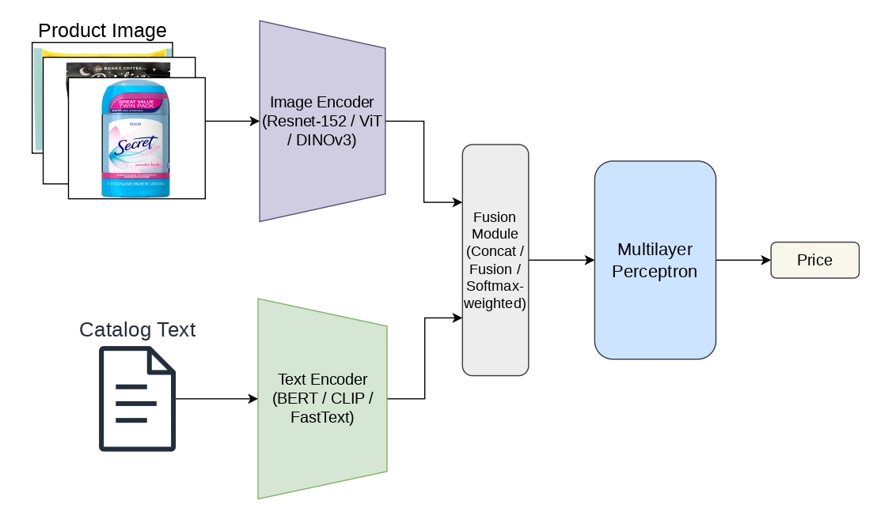

# Multimodal Price Prediction from Product Images and Text

## Project Overview

This project addresses multimodal product price prediction from two inputs: a product image and its catalog text description. The objective is to regress a single USD price by combining complementary visual and textual signals.

The implemented framework uses pretrained visual and textual encoders, a configurable fusion module, and a regression head. The project compares multiple architectural choices across:
- visual encoders: ResNet, ViT, DINOv3
- text encoders: BERT, CLIP, FastText
- fusion strategies and regression head variants

Experiments are conducted on the Amazon ML Challenge 2025 dataset (75,000 samples with paired image-text data). Evaluation uses SMAPE as the primary metric, with MAE and RMSE as additional metrics.

Our main findings indicate that transformer-based visual encoders outperform CNN-based alternatives, DINOv3 + CLIP yields the strongest multimodal representation in this setup, and fine-tuning pretrained encoders improves results over frozen features. A task-specific trained multimodal model also outperforms zero-shot numeric price prediction with Qwen2.5-VL.

### Architecture



## Quick Start

From the `ProjectDeepLearning` directory:

```bash
# 1) Create and activate the environment
conda env create -f environment.yml
conda activate multimodal-price-prediction

# 2) Ensure dataset assets exist
# Required:
# - data/data.csv
# - data/images/*.jpg
# Optional helper:
jupyter lab setup_assets.ipynb

# 3) Train
python main.py --train

# 4) Evaluate (uses checkpoint path from src/config.py)
python main.py --evaluate
```

## Data Preparation

Expected input assets:
- `data/data.csv`
- `data/images/` (downloaded product images)

Required CSV columns:
- `image_link`
- `catalog_content`
- `price`

Image filename rule:
- Images are matched by URL basename from `image_link`.
- Example: `https://.../51mo8htwTHL.jpg` must exist as `data/images/51mo8htwTHL.jpg`.

Recommended setup (notebook):
```bash
jupyter lab setup_assets.ipynb
```
The notebook downloads product images into `data/images/` and downloads the FastText asset (`cc.en.300.bin`) for FastText-based runs.

## How to Run

Run all commands from `ProjectDeepLearning/`.

Main pipeline (`main.py`) uses settings from `src/config.py` (encoders, fusion, paths, batch size, epochs, checkpoint path, etc.).

Train:
```bash
python main.py --train
```

Evaluate:
```bash
python main.py --evaluate
```
By default this loads `CHECKPOINT_PATH` from `src/config.py`.

Optional baseline (Qwen2.5-VL):
```bash
# Evaluate on validation split
python qwen_eval.py --split val --max-samples 500

# Evaluate on test split and save predictions
python qwen_eval.py --split test --save-preds outputs/qwen_test_preds.csv
```

Useful Qwen options:
- `--model-name`: choose VLM checkpoint
- `--max-samples`: limit sample count for quick tests
- `--temperature`, `--top-p`: generation controls

## Repository Organization

```text
ProjectDeepLearning/
├── .gitignore
├── README.md                       # Project documentation
├── environment.yml                 # Conda environment specification
├── main.py                         # Main training/evaluation entry point
├── qwen_eval.py                    # Qwen2.5-VL baseline evaluation
├── setup_assets.ipynb              # Asset setup notebook (images + FastText)
├── data/
│   ├── data.csv                    # Dataset metadata: image link, text, price
│   ├── example.ipynb               # Data exploration notebook
│   └── utils.py                    # Image download helpers
└── src/
    ├── __init__.py
    ├── config.py                   # Central config (paths, model, training, W&B)
    ├── data/
    │   ├── __init__.py
    │   ├── dataloader.py           # Splits, transforms, collate/tokenization
    │   └── dataset.py              # Dataset class + filtering rules
    ├── models/
    │   ├── __init__.py
    │   ├── fusion/
    │   │   ├── __init__.py
    │   │   └── mlp.py              # Fusion/regression head implementations
    │   ├── image_encoders/
    │   │   ├── __init__.py
    │   │   ├── dinov3_encoder.py   # DINOv3 encoder wrapper
    │   │   ├── resnet_encoder.py   # ResNet encoder wrapper
    │   │   └── vit_encoder.py      # ViT encoder wrapper
    │   └── text_encoders/
    │       ├── __init__.py
    │       ├── bert_text_encoding.py # BERT encoder wrapper
    │       ├── clip_text_encoder.py  # CLIP text encoder wrapper
    │       └── fast_text.py          # FastText encoder wrapper
    └── utils/
        ├── __init__.py
        ├── helpers.py              # Seed/checkpoint/general utilities
        └── metrics.py              # SMAPE and evaluation metrics
```

## Configuration

All runtime settings are centralized in `src/config.py`.

Recommended workflow:
1. Edit `src/config.py`.
2. Run `python main.py --train` or `python main.py --evaluate`.

Key settings to edit first:

| Area | Main fields |
|---|---|
| Data paths | `CSV_PATH`, `IMAGES_DIR` |
| Splits / reproducibility | `TRAIN_SPLIT`, `VAL_SPLIT`, `TEST_SPLIT`, `RANDOM_SEED` |
| Encoders | `IMAGE_ENCODER`, `TEXT_ENCODER`, `IMAGE_ENCODER_VARIANT`, `TEXT_ENCODER_VARIANT` |
| Fusion head | `FUSION_MLP_TYPE`, `FUSION_METHOD`, `FUSION_HIDDEN_DIMS` |
| Training | `BATCH_SIZE`, `NUM_EPOCHS`, `LEARNING_RATE`, `WEIGHT_DECAY` |
| Optimization behavior | `LR_SCHEDULER`, `EARLY_STOPPING_PATIENCE`, `GRAD_CLIP_NORM` |
| Checkpointing | `CHECKPOINT_PATH` |
| Runtime device | `DEVICE` |
| Experiment tracking | `WANDB_PROJECT_NAME`, `WANDB_ENTITY`, `WANDB_MODE` |
| Qwen baseline | `QWEN_MODEL_NAME`, `QWEN_PROMPT_TEMPLATE`, `QWEN_MAX_NEW_TOKENS` |

FastText note:
- If `TEXT_ENCODER = "fasttext"`, ensure `FASTTEXT_MODEL_PATH` points to a valid `cc.en.300.bin` file.

## References

1. Oriane Siméoni, Huy V. Vo, Maximilian Seitzer, Federico Baldassarre, Maxime Oquab, Cijo Jose, Vasil Khalidov, Marc Szafraniec, Seungeun Yi, Michaël Ramamonjisoa, Francisco Massa, Daniel Haziza, Luca Wehrstedt, Jianyuan Wang, Timothée Darcet, Théo Moutakanni, Leonel Sentana, Claire Roberts, Andrea Vedaldi, Jamie Tolan, John Brandt, Camille Couprie, Julien Mairal, Hervé Jégou, Patrick Labatut, and Piotr Bojanowski. *DINOv3*. arXiv:2508.10104, 2025.  
   Paper: https://arxiv.org/abs/2508.10104  
   Repo: https://github.com/facebookresearch/dinov3

2. Alec Radford, Jong Wook Kim, Chris Hallacy, Aditya Ramesh, Gabriel Goh, Sandhini Agarwal, Girish Sastry, Amanda Askell, Pamela Mishkin, Jack Clark, Gretchen Krueger, and Ilya Sutskever. *Learning Transferable Visual Models From Natural Language Supervision*. ICML, 2021.  
   Paper: https://arxiv.org/abs/2103.00020  
   Repo: https://github.com/openai/CLIP

3. Kaiming He, Xiangyu Zhang, Shaoqing Ren, and Jian Sun. *Deep Residual Learning for Image Recognition*. CVPR, 2016.  
   Paper: https://arxiv.org/abs/1512.03385  
   Repo: https://github.com/pytorch/vision

4. Piotr Bojanowski, Edouard Grave, Armand Joulin, and Tomas Mikolov. *Enriching Word Vectors with Subword Information*. TACL, 2017.  
   Paper: https://arxiv.org/abs/1607.04606  
   Repo: https://github.com/facebookresearch/fastText

5. An Yang et al. *Qwen2.5 Technical Report*. arXiv:2412.15115, 2024.  
   Paper: https://arxiv.org/abs/2412.15115  
   Repo: https://github.com/QwenLM/Qwen2.5-VL

6. Jacob Devlin, Ming-Wei Chang, Kenton Lee, and Kristina Toutanova. *BERT: Pre-training of Deep Bidirectional Transformers for Language Understanding*. NAACL-HLT, 2019.  
   Paper: https://arxiv.org/abs/1810.04805  
   Repo: https://github.com/google-research/bert

7. Alexey Dosovitskiy, Lucas Beyer, Alexander Kolesnikov, Dirk Weissenborn, Xiaohua Zhai, Thomas Unterthiner, Mostafa Dehghani, Matthias Minderer, Georg Heigold, Sylvain Gelly, Jakob Uszkoreit, and Neil Houlsby. *An Image is Worth 16x16 Words: Transformers for Image Recognition at Scale*. ICLR, 2021.  
   Paper: https://arxiv.org/abs/2010.11929  
   Repo: https://github.com/google-research/vision_transformer

## License

This project is licensed under the MIT License. See [LICENSE](LICENSE) for details.
